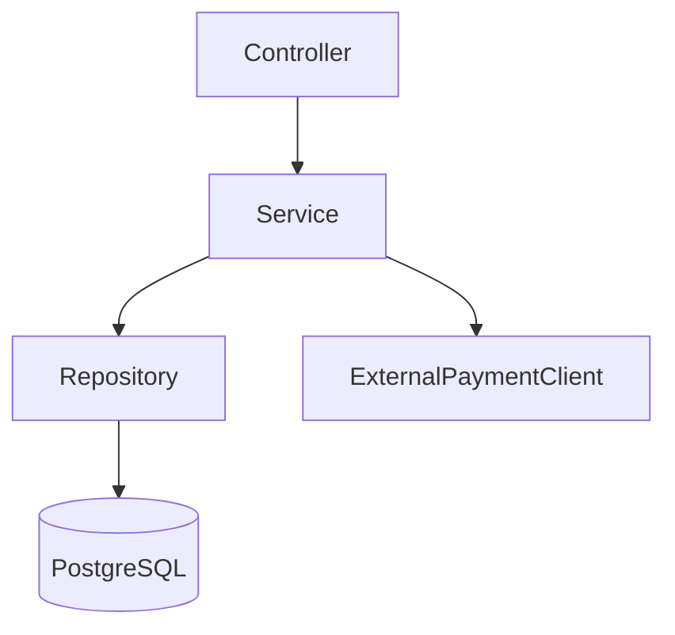

<!-- _class: lead -->
<!-- _paginate: skip -->

# 🏛️ KI-unterstützte Softwarearchitektur
## Von der Entscheidung bis zum Guardrail — mit Java- und ArchUnit-Beispielen

Ganztageskurs, basierend auf dem iSAQB®-Curriculum **AGENTA**
*Architecture for Agentic Software Engineering Contexts*

---

## Über diesen Kurs

- Basis: **iSAQB® CPSA-A Curriculum „AGENTA"** (2026.1-rev5), inhaltlich verdichtet und mit praktischen Java-Beispielen ergänzt
- Zielgruppe: Software-Architekt:innen und erfahrene Entwickler:innen, die mit KI-Agenten arbeiten oder deren Einführung verantworten
- Fokus: **wie Architekturarbeit sich verändert**, wenn LLMs und Agenten als Werkzeuge im Entwicklungsprozess mitarbeiten
- Durchgehendes Praxisbeispiel: **ArchUnit** als „Harness" für Architekturregeln in Java-Projekten

---

## Tagesagenda (1 Tag, komprimiert aus dem 3-Tage-Curriculum)

| Zeit | Kapitel | Fokus |
|---|---|---|
| 08:30–09:15 | 1. Einführung & Grundlagen | LLM, Agenten, Begriffe |
| 09:15–10:15 | 2. KI-unterstützte Architekturentscheidungen | Decision Lifecycle |
| 10:15–10:30 | ☕ Pause | |
| 10:30–11:45 | 3. Architekturwissen für Agenten | Context Engineering |
| 11:45–13:00 | 4. Agenten an Zielen ausrichten | **ArchUnit-Workshop** |
| 13:00–13:45 | 🍽️ Mittagspause | |
| 13:45–15:00 | 5. Architektur-Informationsextraktion | ADRs, Views mit KI |
| 15:00–15:15 | ☕ Pause | |
| 15:15–16:00 | 6. Governance & Quality Gates | Recht, Security, Nachhaltigkeit |
| 16:00–16:45 | 7. Die Rolle des Architekten im Wandel | Skills, Adoption |
| 16:45–17:00 | Wrap-up & Q&A | |

---

<!-- _class: divider lead -->

# Kapitel 1
## Einführung und Grundlagen

---

## Was lernen wir in Kapitel 1?

Ziel: eine gemeinsame Begriffsbasis für den ganzen Tag — auch für Teilnehmende ohne Vorerfahrung.

- Wichtige Begriffe der KI-Disziplinen und ihre Unterschiede
- Grundlagen von LLMs (Daten, Modell, Training, Inferenz)
- Wirkung von Prompt- und Context-Engineering auf die Ausgabequalität
- Was ein AI-Agent ist und was „agentic engineering" bedeutet
- Praktische Schulen des agentic engineering (Autonomie-Spektrum)
- Bezug von KI-gestütztem Arbeiten zur klassischen Softwarearchitektur

---

## Begriffslandkarte

| Begriff | Kurz erklärt |
|---|---|
| **KI (AI)** | Oberbegriff für Systeme, die „intelligentes" Verhalten zeigen |
| **ML** | Teilbereich: Systeme lernen Muster aus Daten statt fest programmiert zu sein |
| **GenAI** | ML-Systeme, die neue Inhalte erzeugen (Text, Code, Bilder) |
| **LLM** | Grosses Sprachmodell — Kernbaustein heutiger Coding-Agenten |
| **Agentic Coding** | Ein LLM handelt selbstständig: liest, schreibt, führt Code aus |
| **Vibe Coding** | Intuitives Prompten ohne Struktur — gut für Prototypen, riskant für Produktion |

**Merksatz:** „Garbage in, garbage out" — die Datenqualität ist die Basis von allem.

---

## LLM-Grundlagen — Daten, Modell, Training, Inferenz

- **Daten** → **Training** (Muster lernen) → **Modell** (gespeicherte Gewichte) → **Inferenz** (Anwendung: nächstes Token vorhersagen)
- LLMs sind **probabilistische** Werkzeuge: die Ausgabe ist eine Stichprobe aus einer Wahrscheinlichkeitsverteilung, nicht eine deterministische Berechnung
  → **Konsequenz für die Architekturarbeit:** dieselbe Frage kann leicht unterschiedliche Antworten liefern — wichtig für Reproduzierbarkeit von Architekturentscheidungen!
- **Tokens**, **Context Window**, **Reasoning** sind die zentralen Bausteine
- Stärken: Sprache, Wissen, strukturierte Ausgabe — Grenzen: Halluzinationen, Bias, Wissens-Cutoff, begrenztes Context-Fenster

---

## Prompt- und Context-Engineering

**Prompt-Engineering** — *wie* man fragt
> Beispiel: „Agiere als Senior-Architekt. Bewerte die folgenden drei Optionen strikt gegen die Qualitätsziele Verfügbarkeit und Wartbarkeit. Antworte als Tabelle."

**Context-Engineering** — *was* das Modell sehen darf/soll
> Beispiel: Architekturregeln, ADRs und Modulgrenzen liegen einmal in `CLAUDE.md`/`AGENTS.md` statt in jedem Prompt neu erklärt zu werden.

> Mehr Kontext ist nicht automatisch besser: irrelevante oder widersprüchliche Informationen verschlechtern die Ergebnisse. Kuratierter Kontext schlägt maximaler Kontext.

---

## Was ist ein AI-Agent? Der agentic Loop

**Assistant** (chattet) vs. **Agent** (handelt: Tools nutzen, Zustand halten)

```
Prompt → Reasoning → Tool-Aufruf → Tool-Ergebnis → (wiederholen) → Antwort
```

**Java-Beispiel:**
„Refaktoriere `OrderService`, sodass er das Repository-Pattern nutzt."
→ Agent liest `OrderService.java` und bestehende Repository-Interfaces
→ schlägt `OrderRepository`-Interface vor
→ implementiert es, passt Aufrufer an
→ führt `mvn test` aus → sieht fehlschlagenden Test → korrigiert
→ wiederholt, bis grün

Fortgeschrittene Techniken: **Planning**, **Sub-Agents**, **Hand-offs**, **Human-in-the-loop**.

---

## Autonomie als Spektrum

Autonomie ist kein Schalter (an/aus), sondern ein **Spektrum** mit mehreren Stufen — von der Idee bis zum Feedback.

| Stufe | Beispiel-Praxis |
|---|---|
| Niedrig | Inline-Code-Vervollständigung (Autocomplete) |
| Mittel | Agent schlägt Diff vor, Mensch bestätigt jeden Schritt |
| Hoch | **Spec-Driven Development**: Mensch + KI co-verfassen eine Spec, Agent implementiert autonom |
| Sehr hoch | Agent-Schwärme, vollautonome Umsetzung mehrerer Tasks parallel |

Aktuelle Praktiken: *Spec-Driven Development*, *Agent Swarms*, *Conversational Programming*.

---

## Bezug zur klassischen Architekturarbeit

Klassische Architekturtätigkeiten — Qualitätsziele definieren, Entscheidungen dokumentieren, Reviews durchführen — werden durch KI **nicht ersetzt**, aber verändert:

- KI kann Optionen **beschleunigen** (Exploration, Prototypen)
- KI kann Entscheidungsdokumentation **entlasten** (Entwürfe für ADRs)
- **Menschliches Urteilsvermögen bleibt nötig** bei Trade-offs, Verbindlichkeit und Verantwortung
- Architekturarbeit lässt sich **in agentische Prozesse verankern**: Prinzipien über Context-Engineering einbetten, Entscheidungen mit Guardrails absichern, Annahmen über automatisiertes Feedback laufend validieren

---

<!-- _class: divider lead -->

# Kapitel 2
## KI-unterstützte Architekturentscheidungen

---

## Der Lebenszyklus einer Architekturentscheidung

Zyklisch, nicht linear:

```
Problem erkennen → Optionen explorieren → (In-)Validierung
   → Entscheidung treffen → Entscheidung etablieren → Ablösung → (von vorn)
```

**Effekt von agentic Engineering:**
- Beschleunigt Exploration und (Prototyp-)Entwicklung
- Ermöglicht — kombiniert mit kontinuierlicher Validierung — **häufigere Entscheidungszyklen**
- Braucht Feedback-Schleifen aus Entwicklung, Test und Betrieb zurück in die Architektur-Reflexion

→ Ziel: ein **kontinuierlicher, evidenzbasierter** Architekturprozess statt seltener „Big Bang"-Entscheidungen.

---

## Top-down: Qualitätsziele → Architekturtreiber

Qualitätsziele in konkrete, bewertbare Kriterien zerlegen (**Quality Scenarios**) — und damit die Ausgabe eines Agenten beurteilen.

**Beispiel Quality Scenario:**
> *„Bei einem Lastanstieg auf 500 gleichzeitige Zahlungsanfragen soll der `PaymentService` innerhalb von 200 ms antworten, ohne Datenverlust."*

- Zielkonflikte zwischen Qualitätszielen erkennen (z. B. Verfügbarkeit vs. Konsistenz)
- **Wichtig:** Architekturtreiber/-ziele und Architekturentscheidungen in **getrennten Artefakten** halten — sonst vermischt der Agent „was gewünscht ist" mit „was schon entschieden wurde"

---

## Bottom-up: strukturelle Schwachstellen erkennen

Gerade in agentischen Kontexten: Technical Debt, unbeabsichtigter Drift, wachsende Komplexität in sich entwickelnden Systemen.

**Etablierte Werkzeuge (auch für Java-Projekte):**
- Technical-Debt-Analyse (SonarQube)
- Statische Strukturanalyse (**ArchUnit**, jQAssistant, jdepend)
- Monitoring-basiertes Feedback, Metriken, Testabdeckung
- Architektur-Reviews

**KI-gestützt ergänzt:**
- Agent führt strukturelle Konsistenz-Checks über mehrere Module hinweg durch
- Agent fasst wiederkehrende Muster aus Reviews/Findings zusammen

---

## Design-Exploration & Architekturvarianten

KI zur Exploration von Architekturoptionen nutzen — **immer verankert** in Treibern, bestehenden Entscheidungen, Constraints und Prinzipien.

**Beispiel-Prompt:**
> „Wir müssen `PaymentService` von synchronen REST-Aufrufen auf asynchrone Verarbeitung umstellen. Berücksichtige unsere ADR-003 (Event-driven mit Kafka) und Qualitätsziel Konsistenz > Latenz. Schlage 2 Varianten vor, je mit Vor-/Nachteilen."

- Kandidaten gegen Treiber, Entscheidungen, Constraints und Prinzipien bewerten
- **Grenzen kennen:** KI-Vorschläge sind nicht automatisch korrekt; Trade-offs sind allgegenwärtig und müssen von Menschen gewichtet werden

---

## Architekturentscheidungen als testbare Hypothesen

Entscheidungen als **Hypothesen** formulieren: Annahmen, erwartete Wirkung auf Qualitätsmerkmale, Risiken, Validierungskriterien.

**Beispiel:**
> *Hypothese:* „Ein Cache vor `ProductCatalogService` reduziert die p95-Latenz von 400 ms auf < 100 ms."
> *Experiment:* Lasttest mit und ohne Cache, gemessen über 3 Szenarien.
> *Validierungskriterium:* p95 < 100 ms bei 200 req/s.

- Leichte Experimente: Spikes, Simulationen, Prototypen, Seite-an-Seite-Variantenvergleiche
- Agentische Experimente sind oft **günstiger** als aufwendig ausgearbeitete Spezifikationen

---

## Grenzen von KI in der Entscheidungsunterstützung

Bekannte Risiken, die kritische Prüfung erfordern:

- Halluzinationen, Bias, Empfindlichkeit gegenüber Prompt-Struktur und Reihenfolge der Instruktionen
- Unterschiedliche Kontext-Wirksamkeit je nach Modell; möglich „gesponserte" Technologie-Empfehlungen
- Modellwechsel während eines Entscheidungsprozesses: Chancen (frische Perspektive) und Risiken (Inkonsistenz)

**Gegenmassnahmen:**
- Explizite **Review-Checkpoints** definieren
- Grenzen für agentische Entscheidungen setzen (Guardrails, siehe Kapitel 4)
- Menschliche Verantwortung für **konsequenzreiche** Entscheidungen bewusst erhalten

---

## Von der Implementierung zur Orchestrierung

Zwei Rollen für Architekt:innen im agentischen Umfeld:

- **Agent an einem festen Plan entlang führen** (Schritt-für-Schritt-Steuerung)
- **Den Agenten-Workflow selbst komponieren** (Orchestrierung: welcher Agent macht was, in welcher Reihenfolge)

**Effekte der Orchestrierung:** höherer Durchsatz (weniger Hand-off-Reibung), aber auch neue Fehlermodi:
- Runaway Agents, Endlosschleifen, verlorene Human-Override-Punkte, kaskadierende Fehler

**Praxis-Regel:** Ziele, Constraints und Akzeptanzkriterien vorgeben — **nicht** den exakten Lösungsweg. Auch Kostenaspekte (Tokens, Loop-Länge, Tool-Aufrufe) gehören ins Orchestrierungsdesign.

---

## 🧪 Übung: Entscheidung als Hypothese formulieren

**Zeit: 15 Minuten**

In 2er-Teams:

1. Wählt eine reale oder fiktive Architekturentscheidung aus eurem Projektumfeld
2. Formuliert sie als Hypothese: Annahme, erwartete Wirkung, Risiko, Validierungskriterium
3. Skizziert ein *leichtgewichtiges* Experiment, das die Hypothese in < 1 Tag prüfen könnte
4. Diskussion: Wo könnte ein KI-Agent bei der Exploration/Umsetzung des Experiments helfen — und wo bräuchte es zwingend menschliches Urteilsvermögen?

---

<!-- _class: divider lead -->

# Kapitel 3
## Architekturwissen für Agenten bereitstellen

---

## Warum das ein Design-Problem ist

Die Qualität der Agent-Ausgabe hängt direkt davon ab, **welche Informationen** der Agent zur Verfügung hat.

- Architekturwissen für Agenten bereitzustellen ist **Engineering-Disziplin**, nicht „ein paar Instruktionen schreiben"
- **Wichtige Grenze:** gutes Kontextwissen erhöht die *Wahrscheinlichkeit* guter Ergebnisse — es **garantiert** sie nicht
- Relevantes Wissen für Agenten: Architekturentscheidungen, Constraints, Qualitätsziele, Prinzipien, Domänenbegriffe, Integrationsregeln, Systemgrenzen

---

## Agent-lesbare Wissensrepräsentation

| Form | Wann geeignet |
|---|---|
| **ADRs** (Architecture Decision Records) | Einzelentscheidungen mit Kontext & Konsequenzen |
| **Architekturregeln als Code** (z. B. ArchUnit) | Maschinell prüfbar, präzise, wartbar |
| **Context-Dateien** (`CLAUDE.md`, `AGENTS.md`) | Projektweite Leitplanken |
| **Diagrams-as-Code** (Mermaid, Structurizr) | Versionierbare, „lebende" Views |
| **Retrieval-Index / Knowledge Base** | Grosse, wachsende Wissensbasis |

**Trade-off:** Präzision vs. Pflegeaufwand vs. Wirksamkeit — je formaler die Repräsentation, desto zuverlässiger prüfbar, aber desto höher der Pflegeaufwand.

---

## Java-Beispiel: Architekturregeln als lesbarer Kontext

Statt nur in Prosa zu beschreiben „Controller dürfen nicht direkt auf Repositories zugreifen", die Regel **ausführbar** machen und gleichzeitig als Dokumentation nutzen:

```java
@AnalyzeClasses(packages = "com.raiffeisen.orders")
class ArchitectureRulesTest {

    @ArchTest
    static final ArchRule controllers_should_not_access_repositories_directly =
        noClasses().that().resideInAPackage("..controller..")
            .should().dependOnClassesThat().resideInAPackage("..repository..");
}
```

→ Diese Regel ist gleichzeitig: **Dokumentation für Menschen**, **Kontext für den Agenten** (er sieht die Testdatei) und **automatisch geprüfte Leitplanke**.

---

## Delivery: Wissen zur richtigen Zeit bereitstellen

- **Retrieval Augmented Generation (RAG):** Agent holt sich bei Bedarf passende Wissensfragmente
- **Skills:** modulare, gezielt ladbare Anleitungen (siehe Vortrag „AI Coding im Alltag")
- **MCP (Model Context Protocol):** standardisierter Zugriff auf externe Wissensquellen (z. B. Confluence, Architektur-Repository)

**Kernfrage:** Wer/was entscheidet, *wann* welches Wissen geladen wird? Zu früh geladen → Kontext überladen; zu spät geladen → Agent trifft Annahmen.

---

## Wirksamkeit messen und verbessern

- Regelmässig prüfen: Ist das verfügbare Architekturwissen **ausreichend**, **gut strukturiert** und **wirksam zugestellt**?
- **Mehr ist nicht besser:** irrelevante/widersprüchliche Informationen verschlechtern die Performance — Balance zwischen Vollständigkeit und Signalqualität
- Iterativen Verbesserungsprozess etablieren, basierend auf beobachtetem Agentenverhalten (welche Fehler wiederholen sich?)
- **Geteilte Dokumente sind kein geteiltes Verständnis** — dafür braucht es weiterhin Disziplinen wie Domain-Driven Design und gemeinsames Modellieren

---

## 🧪 Übung: Kontext-Audit für ein reales Repo

**Zeit: 20 Minuten**

1. Öffnet ein Repository, das ihr kennt
2. Listet auf: Welches Architekturwissen ist *für einen Menschen* dokumentiert (README, ADRs, Wiki)?
3. Listet auf: Welches davon wäre *für einen Agenten* in `CLAUDE.md`/`AGENTS.md` oder als ArchUnit-Regel sinnvoll?
4. Identifiziert 2–3 Lücken: Wissen, das nirgends steht, aber jede erfahrene Person „einfach weiss"
5. Diskussion im Plenum: Welche Lücke war am überraschendsten?

---

<!-- _class: divider lead -->

# Kapitel 4
## Agenten an Architekturzielen ausrichten
### ArchUnit-Workshop

---

## Warum brauchen Agenten explizite Kontrolle?

- Ohne explizite Constraints produzieren Agenten tendenziell Code, der Architekturentscheidungen verletzt, technische Schulden anhäuft, Inkonsistenzen einführt
- Wissen **allein** (im Kontext) reicht nicht — es braucht **Enforcement**
- Wichtige Einordnung: explizite Architekturkontrollen behindern potenziell Evolvierbarkeit → sie sind eine **temporäre, „abschmelzende" Investition**, die reduziert werden kann, sobald Modelle/Agenten Regeln zuverlässiger selbst einhalten

---

## Harness Engineering: präventiv + detektiv

Zwei Arten von Kontrollen, die zusammenwirken:

| Typ | Beispiel | Wirkung |
|---|---|---|
| **Präventiv** | Permission-Konfiguration, Sandboxing, Tool-Allowlists | verhindert unerwünschte Aktionen von vornherein |
| **Detektiv** | ArchUnit-Tests, Linter, Static Analysis, Review-Gates | erkennt Verstösse nach der Tat, vor dem Merge |

**Trade-off:** Präzision vs. Abdeckung, Geschwindigkeit vs. Analysetiefe.

Atomare Strukturregeln (z. B. „Package X darf nicht auf Y zugreifen") lassen sich **schnell und deterministisch** prüfen. Ganzheitliche Qualitätsmerkmale (Wartbarkeit, Usability) liefern nur **holistisches Feedback** — schwer zu automatisieren.

---

## ArchUnit: die Grundidee

**ArchUnit** ist eine freie Java-Testbibliothek, mit der Architekturregeln als **JUnit-Tests** geschrieben und in der CI automatisch geprüft werden.

```xml
<dependency>
    <groupId>com.tngtech.archunit</groupId>
    <artifactId>archunit-junit5</artifactId>
    <version>1.3.0</version>
    <scope>test</scope>
</dependency>
```

- Läuft wie jeder andere Test — **schnell, deterministisch, in der CI-Pipeline**
- Prüft Pakete, Klassen, Abhängigkeiten, Namenskonventionen, Schichten, Zyklen
- Ist damit ein **idealer „detektiver" Guardrail** für agentischen Code — der Agent bekommt bei einem Verstoss sofort ein rotes Testergebnis als Feedback

---

## Beispiel 1: Geschichtete Architektur erzwingen

```java
@AnalyzeClasses(packages = "com.raiffeisen.orders")
class LayeredArchitectureTest {

    @ArchTest
    static final ArchRule layer_dependencies_are_respected =
        layeredArchitecture()
            .consideringAllDependencies()
            .layer("Controller").definedBy("..controller..")
            .layer("Service").definedBy("..service..")
            .layer("Persistence").definedBy("..persistence..")

            .whereLayer("Controller").mayNotBeAccessedByAnyLayer()
            .whereLayer("Service").mayOnlyBeAccessedByLayers("Controller")
            .whereLayer("Persistence").mayOnlyBeAccessedByLayers("Service");
}
```

→ Wenn ein KI-Agent versucht, direkt von `Controller` auf `Persistence` zuzugreifen, **schlägt der Build fehl** — bevor es in den PR schafft.

---

## Beispiel 2: Namenskonventionen & Zyklenfreiheit

```java
@ArchTest
static final ArchRule services_should_be_named_correctly =
    classes().that().resideInAPackage("..service..")
        .should().haveSimpleNameEndingWith("Service");

@ArchTest
static final ArchRule no_cyclic_dependencies_between_modules =
    slices().matching("com.raiffeisen.orders.(*)..")
        .should().beFreeOfCycles();
```

- Namensregeln machen implizite Konventionen **explizit und prüfbar** — genau das, was ein Agent sonst „erraten" müsste
- Zyklenfreiheit ist ein klassisches Architektur-Fitness-Function-Beispiel: verhindert schleichende Kopplung zwischen Modulen

---

## Beispiel 3: Bestehende Verstösse „einfrieren" (Freezing)

In gewachsenen Systemen gibt es oft schon Verstösse. `FreezingArchRule` erlaubt: **keine neuen Verstösse zulassen**, ohne sofort alle alten zu beheben.

```java
@ArchTest
static final ArchRule freeze_legacy_violations =
    FreezingArchRule.freeze(
        noClasses().that().resideInAPackage("..legacy..")
            .should().dependOnClassesThat().resideInAPackage("..api.internal..")
    );
```

→ Ideal für die **schrittweise Einführung** von Architekturkontrollen in bestehende Codebasen (siehe nächste Folie) — der Agent kann im Legacy-Teil weiterarbeiten, ohne dass jede historische Verletzung sofort blockiert, aber **keine neue** darf hinzukommen.

---

## Wo im Prozess ansetzen?

| Zeitpunkt | Kontrolle |
|---|---|
| Lokal, während der Agent arbeitet | Schnelle ArchUnit-Teilmenge, Linter, Type-Checker |
| Pre-Commit / Pre-PR | Vollständige ArchUnit-Suite, Tests |
| CI-Pipeline | ArchUnit + SonarQube + Security-Scan, Merge-Gate |
| Kontinuierlich (Nightly) | Vollständige Strukturanalyse, Drift-Reports |

**Wichtig:** KI-gestützte Entwicklung kann Architektur-Drift **schneller** erzeugen als klassische Review-Zyklen es abfangen — deshalb Kontrollen so früh und so automatisiert wie möglich platzieren.

---

## Kontrollen in bestehende Codebasen einführen

Strategie für Systeme, die nicht für agentische Entwicklung gebaut wurden:

1. **Bestandsaufnahme:** Wie „archunit-freundlich" ist die Codebasis? (klare Pakete? oder alles in einem Package?)
2. **Freezing zuerst:** bestehende Verstösse einfrieren, keine neuen zulassen
3. **Priorisieren:** zuerst Regeln für die Bereiche mit dem höchsten Risiko/Änderungsvolumen
4. Abwägen: Aufwand der Einführung vs. Risiko, Agenten **ohne** Kontrollen operieren zu lassen

**Regel als Prozess verbessern:** wenn ein Agentenfehler durchrutscht, wird daraus eine neue oder geschärfte ArchUnit-Regel — die Kontrolle lernt aus Fehlern.

---

## 🧪 Übung: Eure erste ArchUnit-Regel

**Zeit: 30 Minuten**

Setup: Spring-Boot-Beispielprojekt mit Controller-/Service-/Repository-Paketen (wird bereitgestellt).

1. Fügt die `archunit-junit5`-Dependency hinzu
2. Schreibt eine Regel: *„Repository-Klassen dürfen nicht von Controllern abhängen"*
3. Lasst einen KI-Agenten (Copilot CLI oder Claude Code) bewusst dagegen verstossen — beobachtet den roten Test
4. Bittet den Agenten, den eigenen Verstoss anhand der Fehlermeldung zu korrigieren
5. Bonus: Schreibt eine `layeredArchitecture()`-Regel für euer eigenes Projekt

**Reflexion:** Wie hat sich die Fehlermeldung der Regel auf das Agentenverhalten ausgewirkt?

---

<!-- _class: divider lead -->

# Kapitel 5
## Architektur-Informationsextraktion

---

## Vier Arten von Architekturdokumentation

| | Ist-Zustand (as-is) | Soll-Zustand (to-be) |
|---|---|---|
| **Menschen-orientiert** | Profitiert stark von KI-Tool-Unterstützung | KI unterstützt, ersetzt aber nicht Diskussion & Entscheidung |
| **Agent-orientiert** | Knappe, maschinenlesbare Repräsentationen oft wirksamer als klassische Dokumente | Kleinere, aber wichtige Rolle für die KI |

**Kernprinzip:** Dokumente sind Mittel zum Zweck (geteiltes Verständnis) — kein Selbstzweck. Das gilt besonders in agentischen Kontexten.

Soll-Dokumente brauchen aktive menschliche Prozesse: reden, diskutieren, bewerten, entscheiden — die Qualität hängt von der Qualität dieser Interaktionen ab, nicht von der KI.

---

## Entscheidungen durch agentische Loops hindurch pflegen

- Lange agentische Iterationsschleifen können die Architektur **implizit** vom ursprünglichen Entscheid wegdriften lassen
- KI kann helfen, **zu erkennen**, wann eine bestehende Entscheidung implizit verändert wird — und dies zur menschlichen Prüfung markieren
- **ADRs** bleiben das Kernwerkzeug: Kontext, Alternativen, Begründung, Konsequenzen — auch für Entscheidungen, die sich **inkrementell** über viele kleine Schritte ergeben haben

**Aber:** organisatorisches Commitment, Stakeholder-Zustimmung und der „soziale Vertrag", der eine Entscheidung verbindlich macht, lassen sich **nicht** durch KI erzeugen oder ersetzen.

---

## Beispiel: KI-unterstützter ADR-Entwurf

**Prompt an den Agenten** (nach einem mehrstündigen Refactoring):

> „Fasse aus unserem Chat-Verlauf, den Git-Commits der letzten 2 Stunden und den Kommentaren im PR zusammen, welche Architekturentscheidung wir gerade getroffen haben. Erstelle einen ADR-Entwurf im Format: Kontext, Optionen, Entscheidung, Konsequenzen."

- Der Agent kann Kontext-Logs, Guardrail-Ausgaben, Chatverläufe, ggf. E-Mails/Meeting-Notizen synthetisieren
- Das Ergebnis ist ein **Entwurf** — er durchläuft zwingend ein **Human-in-the-loop-Review** zur Validierung, Korrektur und Vervollständigung

---

## Architekturinformationen aus bestehenden Systemen extrahieren

KI + klassische Analyse kombiniert liefert bessere Abdeckung und Genauigkeit als jedes davon allein:

- **Artefakte zusammenfassen:** Quellcode, Deployment-Deskriptoren, Konfiguration, Tests, Schnittstellen
- **Strukturinformationen interpretieren:** Code, Repositories, Abhängigkeitsgraphen → Knowledge Graphs / Strukturmodelle
- **Technologien & Muster erkennen:** Code-Property-Graphs (z. B. Joern) oder KI-Coding-Agenten
- **Kandidaten-Geschäftsregeln extrahieren:** aus Code, Tests, Konfiguration — zur Validierung mit Fachexpert:innen
- **Lücken/Unsicherheiten identifizieren** und mit statischer/dynamischer Analyse sowie Stakeholder-Gesprächen validieren

---

## Java-Beispiel: Geschäftsregeln aus Legacy-Code extrahieren

**Ausgangslage:** eine 300-Zeilen-`OrderValidator`-Klasse ohne Dokumentation.

**Prompt:**
> „Lies `OrderValidator.java`. Liste alle Geschäftsregeln auf, die dort implementiert sind, als nummerierte Liste in fachlicher Sprache (nicht Code). Markiere Regeln, die auf Sonderfälle oder Altlasten hindeuten (`// TODO`, ungewöhnliche Bedingungen, hartcodierte IDs)."

**Wichtig:** das Ergebnis sind **Kandidaten** — sie müssen mit Fachexpert:innen validiert werden, bevor sie z. B. in ein Domain-Glossar oder eine Spezifikation übernommen werden.

---

## Architektur-Views aus gesammeltem Wissen generieren

- KI unterstützt Erstellung **und laufende Pflege** von Views — kombiniert mit statischer/dynamischer Analyse
- **Diagrams-as-Code** ist der Schlüssel für versionierbare, „lebende" Dokumentation

**Mermaid-Beispiel** (von einem Agenten aus Spring-Boot-Modulstruktur generiert):



- Generierte Views immer gegen tatsächliches Systemverhalten und Entwicklerwissen **validieren**
- Wert für Analyse, Kommunikation und Modernisierungsplanung

---

## 🧪 Übung: ADR-Entwurf mit KI + Review

**Zeit: 20 Minuten**

1. Wählt eine echte (oder fiktive) technische Entscheidung aus einem laufenden Projekt
2. Lasst einen Agenten anhand einer kurzen Beschreibung einen ADR-Entwurf erstellen (Kontext, Optionen, Entscheidung, Konsequenzen)
3. Reviewt den Entwurf zu zweit: Was fehlt? Was ist falsch/zu allgemein? Welche Annahme hat die KI stillschweigend getroffen?
4. Korrigiert den ADR gemeinsam
5. Diskussion: Wo genau war menschliches Urteilsvermögen unersetzlich?

---

<!-- _class: divider lead -->

# Kapitel 6
## Governance und Quality Gates für KI-Nutzung

---

## Rechtlicher Rahmen — worauf achten?

- **Urheberrecht:** Copyleft-Lizenzen, Pflichten bei Nutzung/Anpassung/Verbreitung von KI-generiertem Code prüfen
- **Datenschutz:** Werden personenbezogene Daten verarbeitet? Rollen klären (Verantwortlicher/Auftragsverarbeiter)
- **EU AI Act:** Rollen, Risikologik, gestaffelte Anwendbarkeit — auf typische KI-Tool-Szenarien anwenden können
- Bei konkreten Vorhaben klären: welche internen/externen Stellen einzubeziehen sind (Datenschutz, Informationssicherheit) — Ergebnis **audit-fähig** dokumentieren

*(Bei Raiffeisen: siehe „AI for Code"-Governance, SITAN-Prozess)*

---

## Nachvollziehbarkeit von KI-Ausgaben

Warum wichtig: Qualitätssicherung, Incident-Analyse, Governance, Auditierbarkeit.

- **Strukturiertes Logging** von Agent-Aktionen und Tool-Aufrufen
- **Konsistente Referenzierung** von Kontext-Artefakten (welche Datei/ADR wurde als Basis genutzt?)
- **Zitieren/Quoting** als Mechanismus für nachprüfbare Herkunft von Aussagen
- Versionierung: Prompt-/Template-Versionierung, Modell-/Konfigurationszustände, nachvollziehbare Änderungen, Logging/Tracing/Monitoring

---

## Governance über Teams hinweg konsistent skalieren

- **Abrechnungsmodelle:** Token-basiert vs. Subscription/Seat-basiert — passendes Modell je Team-/Use-Case-Kontext wählen
- **Abhängigkeitsrisiken:** Vendor-Lock-in, Datensouveränität bei der Wahl von LLM-Anbietern berücksichtigen
- **Guardrails für Agenten & Tools:** reduzieren Risiken wie Compliance-Verstösse, Datenlecks, Missbrauch
- **Allowlist-Strategie** für Tool-Integrationen (MCP-Server!) mit klaren Freigabeprozessen — Trade-off Flexibilität vs. Kontrolle je nach Organisationsbereich

---

## Nachhaltigkeit von KI-gestützter Entwicklung

- Umweltwirkungen über den gesamten Lebenszyklus verstehen — typische Fehleinschätzungen kennen
- Wichtige Treiber für Energie-/Emissionswirkung: **Modellgrösse**, mehrstufige/agentische Workflows (viele Tool-Aufrufe = viele Inferenzen)
- Praktische Konsequenz: kleineres Modell wählen, wenn es für die Aufgabe reicht (z. B. `haiku` für einen Log-Analyzer-Subagent statt `opus`)
- Bewusstsein dafür in der Organisation verankern

---

## Umgang mit sensiblen Informationen

- Sensible Informationen identifizieren und klassifizieren — was darf **nicht** an KI-Tools weitergegeben werden
- Datenflüsse und Datenspeicherung von KI-Tool-Nutzung bewerten, Schlüsselrisiken identifizieren
- Team-taugliche Regeln für Auswahl und Nutzung von KI-Tools definieren — sicher und datenschutzkonform

**Java-/Repo-Praxis:** `.env`, Secrets, produktive Konfigurationsdateien in `.gitignore` **und** in Agent-Permission-Denylists (`deny-tools`) führen.

---

## Sicherheit von Agent- und Tool-Integrationen

- **OWASP Top 10 für LLM-Anwendungen** und **MITRE ATLAS** kennen — insbesondere Prompt Injection und Tool-Missbrauch
- **Prompt Injection** (direkt/indirekt) erkennen: das „Confused-Deputy"-Risiko — der Agent nutzt seine Rechte im Auftrag eines manipulierten Inputs
- Robuste Prompt-/Kontextgrenzen: klare Trennung von Daten und Instruktionen, **kein Vertrauen** in extern bezogene Inhalte
- Massnahmen: **Least Privilege**, scoped Credentials, explizite Freigaben/Human-in-the-loop, Monitoring
- **Sandboxing**: Container- vs. VM-basierte Ausführung von Tools — Vor-/Nachteile abwägen

> Die „lethale Trifecta": private Daten + nicht vertrauenswürdiger Inhalt + externe Kommunikationsfähigkeit — diese Kombination in einem Agenten ist besonders gefährlich.

---

<!-- _class: divider lead -->

# Kapitel 7
## Die sich wandelnde Disziplin der Softwarearchitektur

---

## Code Ownership bleibt bestehen

> „You push it, you own it."

- Verantwortung für das Ergebnis bleibt bei der Person, die committet — unabhängig davon, wer/was den Code geschrieben hat
- Risiko von **Skill-Atrophie** durch Überreliance auf KI
- Gegenmassnahmen: bewusste KI-freie Übungsphasen, „Human-first / AI-second"-Reasoning, klassische **und** KI-gestützte Katas, KI als Lerninstrument (erklären lassen, zusammenfassen lassen, hinterfragen)
- Kritisches Denken bleibt zentral: Fragen stellen, bis echtes Verständnis da ist — KI-Ergebnisse mit eigenem Wissen und Beobachtungen gegenprüfen

---

## Architektonisches Urteilsvermögen bewahren

- Agent-Entscheidungen sind geprägt durch verfügbaren Kontext **und** Biases (Trainingsdaten-Bias zu bestimmten Anbietern/Frameworks, Bias aus bestehenden Artefakten der eigenen Organisation)
- KI-gestütztes **Reasoning** von **delegierter Entscheidung** unterscheiden können
- Erkennen, welche Architekturtätigkeiten **menschlich verantwortet** bleiben müssen (kann sich künftig ändern)
- **Gemeinsame Terminologie** (Domain-Glossar, Ubiquitous Language) macht Agenten-Entscheidungen vorhersehbarer und design-konformer
- Erfolgsmessung: architektonische **Fähigkeit** verbessern, nicht nur Output-Geschwindigkeit — Ziel ist Wirkung für Nutzende, nicht Menge (**„AI Slop" vermeiden**)

---

## Was treibt erfolgreiche Einführung von KI-Praktiken?

- **Hypothesengetriebene Einführung**: Problem identifizieren → Hypothese → Experiment → Ergebnis messen — statt breiter, ungezielter Rollouts
- Einführung als **kontinuierlicher, mehrstufiger Prozess** (Zugang → Adoption → Kompetenz → Arbeitsweise → organisatorischer Wandel)
- Enabler: Trainings, Hackathons, geschützte Lernzeit, klare **Ownership** der Einführung
- Lernkultur mit psychologischer Sicherheit (Fehler & Rückfragen erlaubt) ist Voraussetzung
- Messgrössen: DORA-Metriken, Lead Time, Change Failure Rate, Developer-Experience-Signale

---

## Neue Rollen, Teams und Architekturebenen

- Neue Zusammenarbeitsmuster (Human + Human + AI); Agent-Topologien: **Solo**, **Sub-Agent**, **Agent-Teams**
- Wichtige Leitplanke: Menschen sprechen weiterhin **miteinander**, nicht nur mit dem Agenten
- Fokusverschiebung: von Zeilen-Code hin zu breiterem, generalistischem, produktzentriertem Denken — Auswirkung auf Hiring, Skill-Entwicklung, Teamgrösse
- Etablierte agile Praktiken verändern sich (PR-Grösse, schnellere Feedback-Zyklen, Kadenz)
- Architektenrolle verändert sich über die Ebenen **Software, Solution, Enterprise** hinweg — mit unterschiedlicher Hebelwirkung von KI-Unterstützung je Ebene

---

## Wrap-up: die wichtigsten Erkenntnisse des Tages

1. LLMs sind probabilistisch — Reproduzierbarkeit und Review bleiben Pflicht, nicht Kür
2. Architekturwissen für Agenten bereitzustellen ist **Engineering-Arbeit**, kein Prompt-Trick
3. **ArchUnit & Co.** machen Architekturregeln gleichzeitig dokumentiert, kommunizierbar und automatisch durchsetzbar
4. ADRs, Views und Dokumentation bleiben nötig — als **geteiltes Verständnis**, nicht als Selbstzweck
5. Governance (rechtlich, sicherheitstechnisch, nachhaltig) ist kein Nachgedanke, sondern Voraussetzung
6. Die Architekt:innenrolle verschiebt sich von „alles selbst entscheiden" zu „Leitplanken setzen und Ergebnisse verantworten"

---

## Nächste Schritte

- ✅ Ein erstes `ArchUnit`-Modul in einem eurer Projekte aufsetzen
- ✅ Eine bestehende Architekturentscheidung als ADR nachdokumentieren (mit KI-Entwurf + Review)
- ✅ `CLAUDE.md`/`AGENTS.md` um eure wichtigsten 3–5 Architekturregeln ergänzen
- ✅ Einen Diagrams-as-Code-Workflow (Mermaid/Structurizr) für eine Kernkomponente ausprobieren
- ✅ Governance-Checkliste (Kapitel 6) auf ein laufendes KI-Vorhaben anwenden

---

<!-- _class: lead -->

# Fragen & Diskussion

> Der Agent kennt den Code. Die Architektur-Entscheidung — inklusive ihrer Begründung, Verbindlichkeit und Grenzen — bleibt eure Verantwortung.

---

## Quellen (Auswahl)

- iSAQB® e. V. — *Curriculum for Advanced Level: AGENTA*, 2026.1-rev5-EN-20260731
- ArchUnit — offizielle Dokumentation, https://www.archunit.org
- Anthropic — *Effective context engineering for AI agents*, *Effective harnesses for long-running agents*
- OWASP — *Top 10 for LLM Applications*; MITRE ATLAS
- Ford, N. & Richards, M. — *Building Evolutionary Architectures* (Fitness Functions)
- Willison, S. — *The lethal trifecta for AI agents*

*Vollständige Literaturliste: siehe iSAQB-AGENTA-Curriculum, Kapitel „References".*
